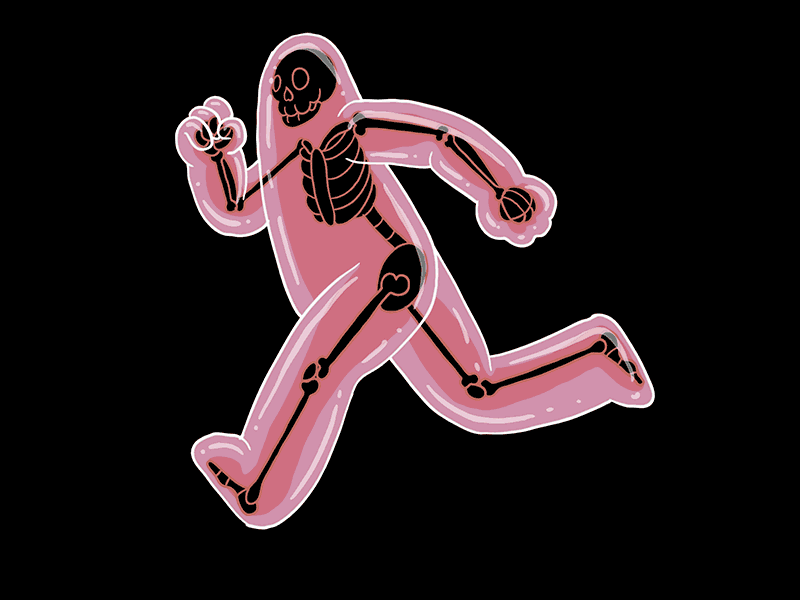
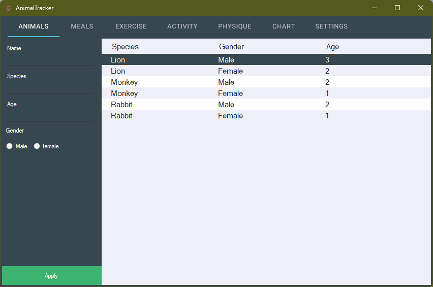
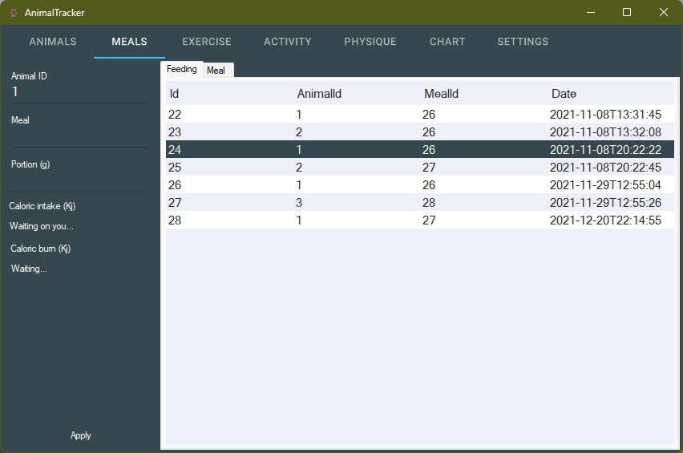
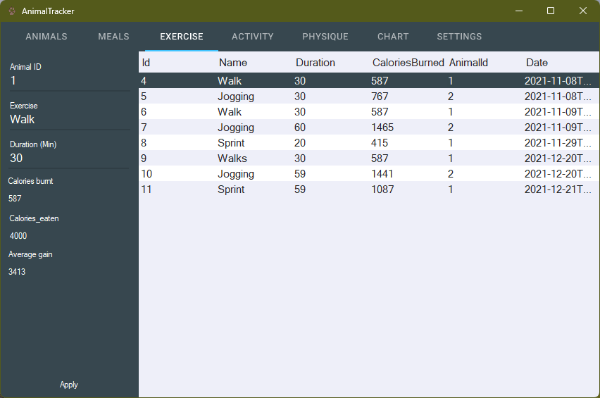
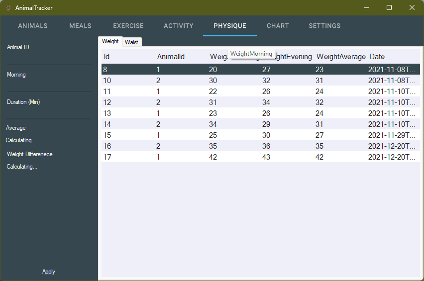
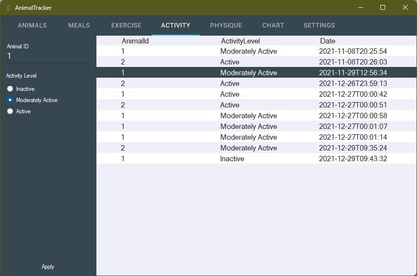
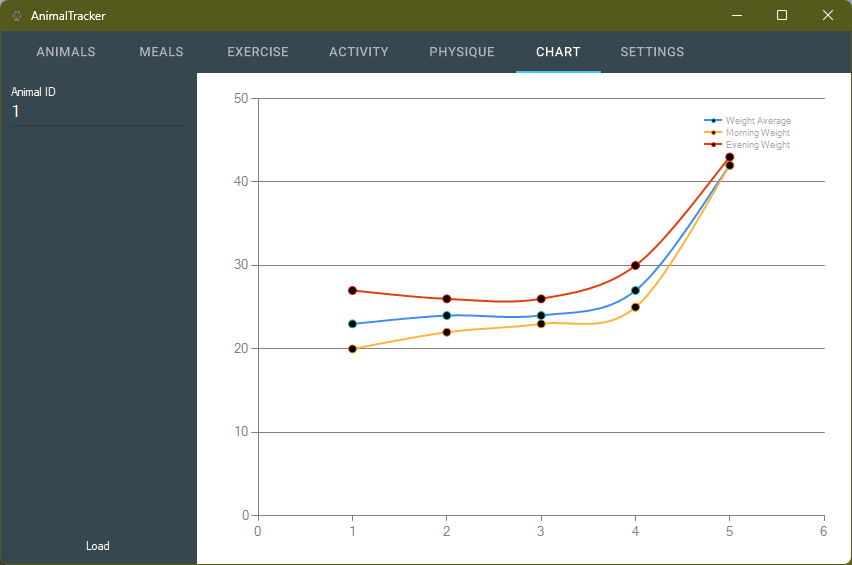

# AnimalTracker

This is an application that takes a list of animals that have to be tracked. This includes the amount of food they eat, their weight and their activity levels. The user interface is still in development and some features will crash upon the new update.

# Features

- CRUD list of animals
- CRUD list of meals
- CRUD list of exercises
- CRUD list of physique
- CRUD list of activity levels
- Retrieve a chart of progress

# Coming soon
- Ability to save previous size
- Theme changer
- Images on profile

# Main interface

This is the first page you see, this is where insertion of animal details takes place and will relate to the other pages for compilation of data.

# Meals

This page provides the ability of the user to record the meals that the animal is eating. Note this system may also be used to track people.

# Exercise

This page enables users to record the amount of exercise an animal has done, and the amount of calories they have burnt doing it.

# Physique

This page records the weight in the morning and evening then displays the average weight at the end of the day

# Activity

This page allows the user to set the activity level of the animal on a particular exercise session.

# Activity

This page shows the weight in the morning and everning compared to the average weight in chart form to represent a visualization of data.

